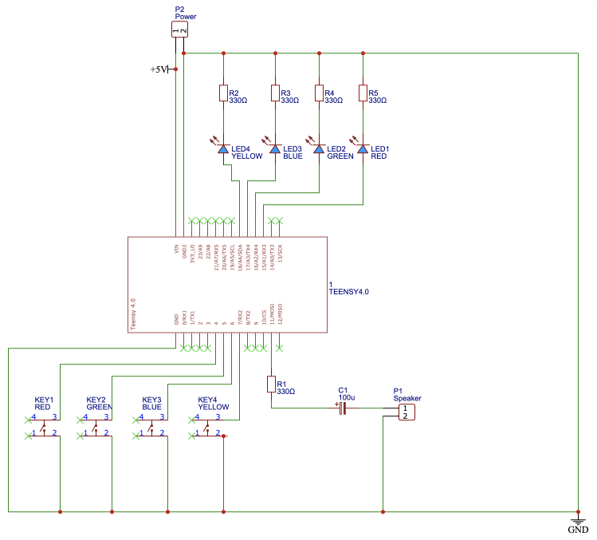

# Teensy Simon

Microcontroller version of [Simon](https://en.wikipedia.org/wiki/Simon_(game)) game.

Built on a Teensy 4.0.

## Colour Pins

| Color  | LED | Switch |
|--------|-----|--------|
| Red    |  15 |    4   |
| Green  |  16 |    5   |
| Blue   |  17 |    6   |
| Yellow |  18 |    7   |

## Sound

Sound is played via tone() to pin 11 connected to a speaker via a resistor and capacitor. See the [tone section](https://www.pjrc.com/teensy/td_pulse.html#tone) on the teensy Pulsed Output: PWM & Tone page.

## Circuit

